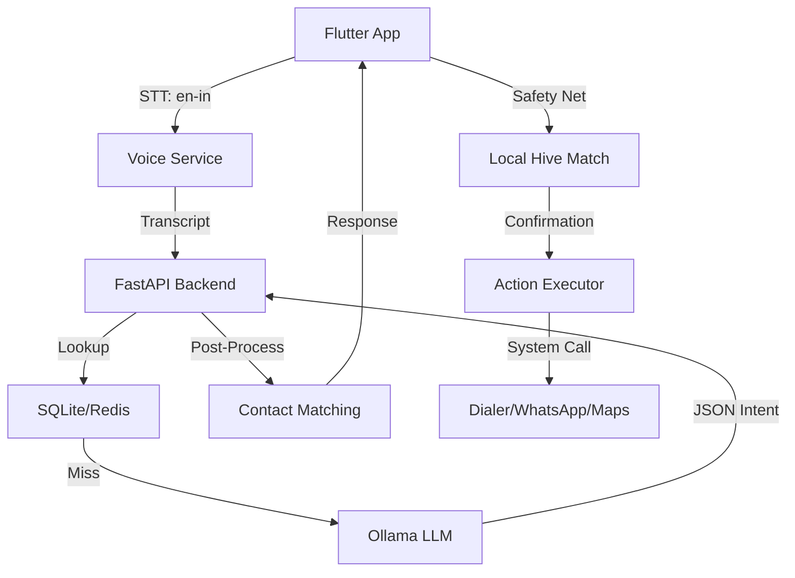

# Saarthi (सारथी) - AI Voice Assistant for Elderly

Saarthi is a production-grade, privacy-focused voice assistant specifically designed for elderly users in India. It simplifies complex smartphone actions into natural voice conversations.

> **Status**: 🛠️ Work in Progress (Productionizing Stage)

---

## 🌟 Key Features

### 🎙️ Intent-Based Voice Control
*   **"Call Ramesh"** - Automatically look up contact and trigger phone dialer.
*   **"WhatsApp daughter"** - Send messages via WhatsApp using voice.
*   **"Navigate to Hospital"** - Open Google Maps with pre-filled destination.
*   **"Play Bhajan"** - Search and play music on YouTube.
*   **"Remind me of medicine"** - Set voice-triggered reminders.
*   **Import from Phonebook** - Easily sync important family contacts from the phone's address book into the Saarthi ecosystem.

### 🧠 Intelligent Backend (Hybrid Architecture)
*   **Indian English STT**: Uses a specialized **Indian English Vosk model** (`en-in-0.4`) optimized for local accents and phonetic nuances.
*   **LLM Processing**: Uses **Ollama (Llama 3)** to parse complex sentences. Now includes **Fuzzy Matching logic** to handle phonetic misinterpretations (e.g., mapping "karl pooper" to "Papa").
*   **Rule-Based Fallback**: Instant processing even when the LLM is slow or offline.
*   **Semantic Caching**: Redis-powered cache for near-instant response to common commands.
*   **Optimized VAD**: Custom-tuned voice activity detection to allow for longer pauses, perfect for elderly users who may speak slowly.

### 👴 Elderly-Friendly UX
*   **High-Contrast UI**: Large buttons and readable fonts for better accessibility.
*   **Confirmation Loop**: The app talks back ("Should I call Ravi?") before taking any action, preventing accidental dials.
*   **Local Safety Net**: If the backend misses a contact name, the app automatically performs a local fuzzy search in its Hive database to find the number.

---

## 🏗️ Architecture



---

## 🚀 Setup & Installation

### 1. Backend (Python/Podman)
Ensure you have Python 3.10+ and Podman (or Docker) installed.

```bash
cd backend
pip install -r requirements.txt
# Start Redis
podman run -d --name saarthi_redis --net host redis:7-alpine
# Start API
python -m uvicorn main:app --host 0.0.0.0 --port 8000
```

### 2. Local Intelligence (Ollama)
Install [Ollama](https://ollama.com/) and download the model:
```bash
ollama run llama3
```

### 3. Flutter App
Ensure your phone is in Developer Mode with USB Debugging enabled.

```bash
flutter pub get
flutter run
```

---

## 🗺️ Roadmap
- [x] Vosk Offline STT Integration (Indian English Model)
- [x] FastAPI Backend with SQLite/Redis
- [x] Intent Parsing via Ollama (Phonetic Logic)
- [x] Proactive Android Permission Handling
- [x] Contact Sync (Address Book -> Backend Sync)
- [ ] Emergency SOS Hardware Trigger
- [ ] Multi-lingual support (Hindi/Hinglish LLM tuning)

---

## 📝 License
Proprietary / Built for User Satisfaction.
